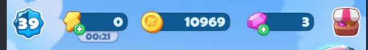
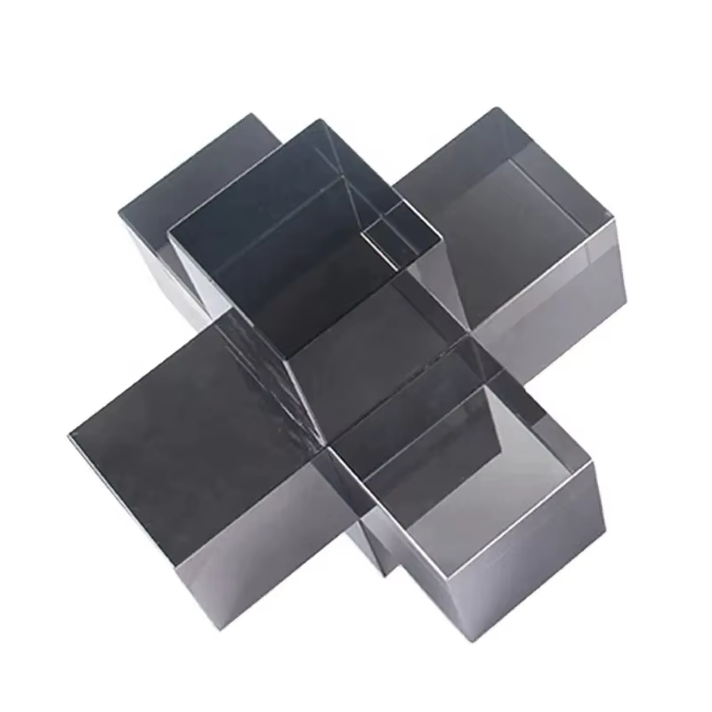

# Visual UI references

## Tasty Travels resource HUD

User-supplied reference saved on 2026-08-28. Use it as a high-level guide for clear resource identity rather than an instruction to reproduce the source UI literally.

Current palette decision informed by this reference:

- Player level: dark blue.
- Credits: bright yellow-gold.
- Gems: violet.
- Energy: cyan.
- Ready dispensers: the game's existing warm amber, kept separate from Credits.

## Mahogany interlocking block

User-supplied reference saved on 2026-08-29. This is a six-direction interlocking block, visually similar to a burr-puzzle joint: three beams cross through one center and create six protrusions. Use it as the structural reference for Wood tier 6 rather than copying its glossy black material.
